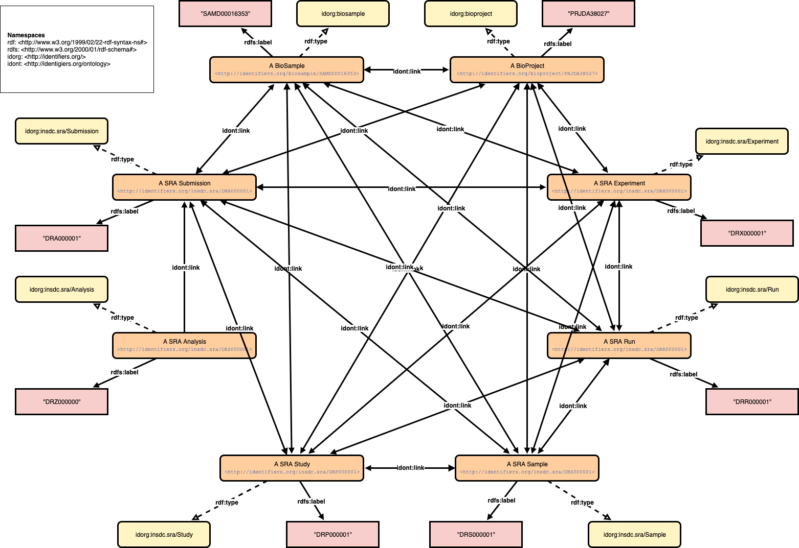

# INSDC Accessions Link RDF

The RDF/JSON-LD data model to describe relations between INSDC entries and conversion scripts.

## The model



## Data

Preparation:

```
$ git clone https://github.com/inutano/insdc-accessions
$ cd insdc-accessions
$ wget "ftp.ncbi.nlm.nih.gov/sra/reports/Metadata/SRA_Accessions.tab"
```

For turtle generation:

```
$ ./bin/accessions-ttl-generator ./SRA_Accessions.tab > SRA_Accessions.ttl
```

For JSON-LD generation (work in progress):

```
$ docker run -it --rm -v $(pwd):/work -w /work ruby:2.6.5-slim bash
# bundle install
# bundle exec rake -T
rake insdc_link:accessions   # Generate JSON-LD for SRA Accessions relation
rake insdc_link:run_members  # Generate JSON-LD for SRA Run Members relation
# bundle exec rake insdc_link:accessions
```
